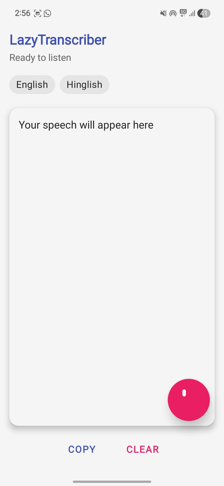
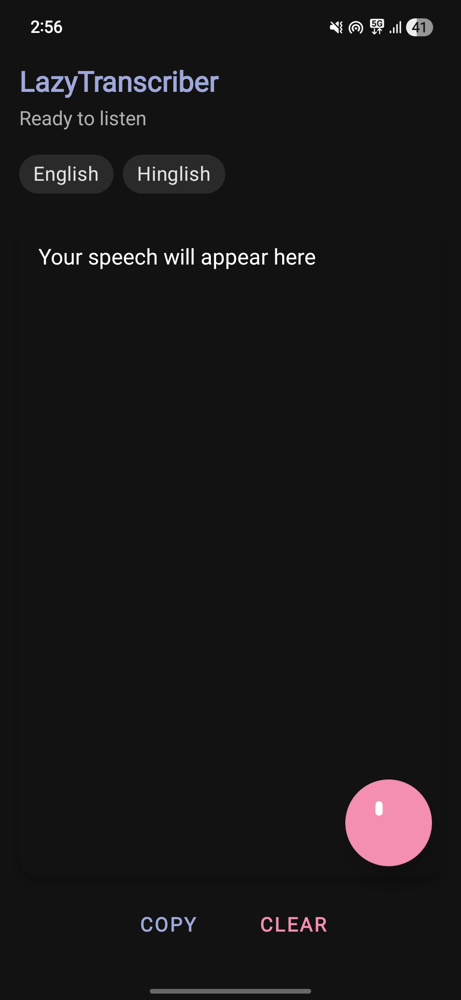
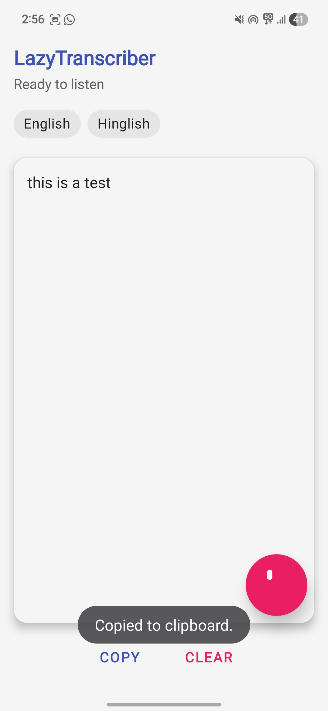

# LazyTranscriber 🎙️

> A native Android application that converts speech into clipboard-ready text — built for situations where typing is slow but voice messages aren't appropriate.

---

## Overview

LazyTranscriber is a lightweight Android productivity utility I designed and built end-to-end in Java. It supports both **English and Hinglish** speech recognition and automatically copies transcribed text to the clipboard — eliminating the friction of dictating and then manually copying text.

What started as a personal tool evolved into a full exploration of Android architecture, speech APIs, runtime permissions, and adaptive theming.

---

## Demo

### Light Mode &nbsp;&nbsp;|&nbsp;&nbsp; Dark Mode &nbsp;&nbsp;|&nbsp;&nbsp; Transcription in Action

|  |  |  |
|:---:|:---:|:---:|
| Light Mode | Dark Mode | Live Transcription |

---

## Key Features

| Feature | Details |
|---|---|
| 🗣️ Speech-to-Text | Real-time English & Hinglish transcription |
| 📋 Auto-copy | Recognized text is instantly sent to clipboard |
| 🌙 Dark Mode | Full system-driven dark/light theme support |
| 🔒 Permission Handling | Runtime microphone permission with graceful fallback |
| 🎨 Material Design | Clean, accessible UI using Material Components |
| 📱 Real-Device Tested | Validated on physical hardware, not just emulator |

---

## Tech Stack

- **Language:** Java
- **Platform:** Android SDK
- **Speech API:** Android `SpeechRecognizer`
- **UI:** Material Components, ConstraintLayout
- **Build:** Gradle

---

## Technical Highlights

### SpeechRecognizer Lifecycle Management
Repeated recognition sessions on Android are notoriously fragile — certain devices silently fail to restart recognition after stopping. I diagnosed this by testing across multiple real-device sessions and resolved it by implementing explicit lifecycle teardown and conditional session recreation, ensuring consistent behavior across device variants.

### System-Driven Dark Mode
Proper dark mode support isn't just a color swap. I structured resource qualifiers (`res/values-night/`) to separate light and dark theming at the resource level, ensuring the app responds correctly to system theme changes without any manual overrides or activity restarts.

### Hinglish Transcription
Android's `SpeechRecognizer` doesn't natively advertise Hinglish as a locale. I experimented with locale configurations and recognition parameters to achieve usable Hinglish transcription — a language pattern common in Indian urban usage that mixes Hindi and English.

### Real-Device Debugging
The Android Emulator introduced speech recognition instability that masked real bugs. Shifting to physical device testing uncovered and resolved timing and permission-handling issues that would have gone undetected otherwise.

---

## Architecture & Code Structure